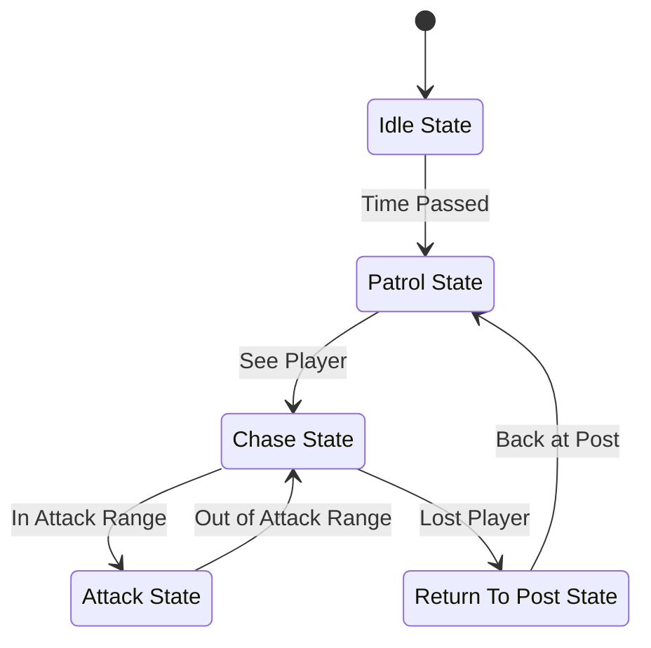

The idea mainly with Dynamic FSM's is that we have structs and classes for states and transitions, then NPC has a Class for their FSM. 
This FSM has a current state and a bunch of transitions, then the transitions can have conditions if we wanted to further obfuscate the way that they work, if the condition is quite complex.

Conditions can just be that however: 
```
struct PlayerDistRangeCondition : public Condition 
{ 
	// can either have members of the checking floats
	// float minVal;
	// float maxVal;
	
	bool check(float potentialParameters)
	{ 
		// check condition and return 
	}
};
```

Conditions can be combined together: 
```
class AndCondition : public Condition
{ 
	Condition A;
	Condition B;
	bool check()
	{ 
		return A.check() && B.chec();
	}
};
```


You can obviously Hard Code FSM's too: 
[[HardCoded FSM]]

```
struct State;
struct IdleState;
struct AttackState;
struct PatrolState;


```

